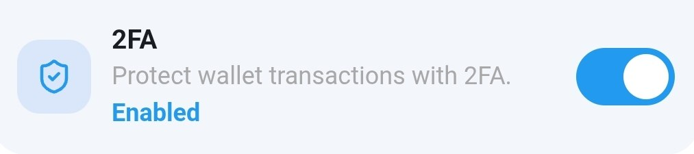
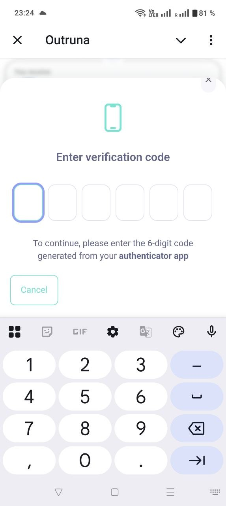
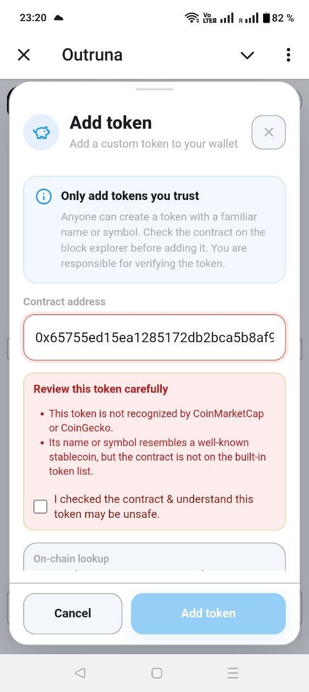
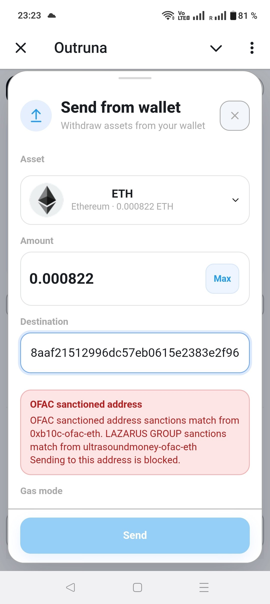

# Outruna

Outruna is a compact, multi-chain EVM wallet for Telegram and the web. Sign in with your Telegram account or email to manage your crypto without installing a browser extension, storing a private key, or writing down a recovery phrase during the standard onboarding process.

Send, receive, and swap assets across supported networks, use a hosted Gas Account when eligible, and access the Russian-language stablecoin-to-fiat P2P feature.

## Try Outruna

- **Website:** [outruna.top](https://outruna.top/)
- **Telegram Mini App:** [@outruna_bot](https://t.me/outruna_bot)
- **Source code:** [github.com/solvetony/outruna](https://github.com/solvetony/outruna)

## Product & Investor Briefings

- [Outruna Presentation — English](https://docs.google.com/presentation/d/1J76bIMKmwbggJVmssSebmz-K1kHAW_pZhNWm8bYa8Dw/edit?usp=sharing)
- [Презентация Outruna — русский язык](https://docs.google.com/presentation/d/1MkhYK01HFCacmrjC4yGyx7BAfA9zbJkLRtf2ivUq5gg/edit?usp=sharing)
- [Outruna 演示文稿 — 中文（自动翻译）](https://docs.google.com/presentation/d/11Sk9URkYoaSVdVgjp1dwSDvQP736E_MMv_cHPvegvHM/edit?usp=sharing)

## Why Outruna

- **Simple onboarding:** Telegram OAuth in Telegram or email sign-in elsewhere.
- **Account-based access:** use the Telegram or email account you already protect instead of managing a private key or mnemonic phrase yourself.
- **Built-in actions:** assets, deposits, withdrawals, swaps, Gas Account, and limited stablecoin P2P are in one mobile-first interface.
- **Smaller dapp attack surface:** Outruna intentionally does not expose a general wallet connection for third-party Web3 sites. That removes a common phishing and malicious-signing path, but it does not eliminate all wallet risk.
- **Focused token support:** native assets and a curated token list, mainly major assets and stablecoins. Users can add custom ERC-20 tokens for visibility after reviewing them.
- **Six supported EVM networks:** Ethereum, Base, Polygon, Optimism, Avalanche, and Arbitrum.

## Why Another Wallet In Telegram?

Telegram users have relatively few familiar crypto entry points. The main alternatives are Wallet in Telegram (`@wallet`) and `@CryptoBot`, alongside general-purpose wallets used outside Telegram. Outruna is designed for users who want a focused multi-chain EVM wallet rather than a broad Telegram marketplace or a general dapp gateway.

Wallet in Telegram now presents two different models: its Crypto Wallet is custodial, while its DeFi Account is self-custodial and focused on TON-ecosystem use cases. `@CryptoBot` is also a centralized custodial service. Custodial products can be convenient, but the provider controls access to the account and may apply withdrawal holds, regional restrictions, account locks, or additional KYC/compliance checks based on its policies and risk controls. Users should review the current terms of any custodial service and should not treat a custodial balance as equivalent to assets held in a wallet they control directly.

Outruna uses Privy's embedded-wallet infrastructure. Privy describes these wallets as user-owned/self-custodial: its [security architecture](https://docs.privy.io/security/wallet-infrastructure/architecture) splits key material into encrypted shares across separate security boundaries and reconstructs it only temporarily when a signing operation is authorized. Depending on the configured execution environment, sensitive operations are handled in a trusted execution environment or on the user's device. Outruna does not expose a complete private key during normal wallet use, and users do not need to store a private key or mnemonic during standard onboarding. That reduces dapp-signing exposure, but it does not remove account, Privy infrastructure, smart-contract, or blockchain risk.

Open-source status also differs. Outruna is published under the MIT License in this repository. Rabby and MetaMask publish major wallet source repositories, while Trezor publishes major firmware and software repositories. Ledger's hardware firmware is not fully open source, and Wallet in Telegram and `@CryptoBot` are not publicly presented as fully open-source wallet products.

## Features

- Embedded EVM wallet provisioning through Privy.
- Deposit QR code and a single EVM address across supported networks.
- Native-token and ERC-20 withdrawals.
- Destination reputation checks and final transaction risk checks through transaction-check service.
- Swap quote simulation validation: provider responses marked as simulation failures are rejected before the quote can be used.
- Direct swap quotes from Uniswap, 0x, and KyberSwap, with automatic routing or manual provider selection.
- Gas Account support for eligible transactions when native gas is insufficient.
- Custom token discovery, contract details, price/logo lookup, and suspicious-token acknowledgement.
- Localized interface: English, Russian, Bengali, German, Spanish, Hindi, and Chinese.
- Limited operator-assisted P2P stablecoin-to-fiat payouts. P2P is currently available only when the interface language is Russian and remains restricted to supported stablecoins, networks, and amount limits.

## Swaps And Fees

Outruna charges a **0.50% integrator fee** on swap output. The fee is included in the quote before confirmation.

Network gas, token approvals, liquidity-provider fees, price impact, and slippage are separate from the Outruna fee. Quotes can change, routes can fail simulation, and an approval or swap can require native gas. Review the final quote and transaction details before signing.

| Wallet or approach | App swap fee | Other costs |
| --- | --- | --- |
| **Outruna** | **0.50%** of the swap output, shown in the quote | Network gas, token approval (if required), liquidity provider fees, price impact, and slippage |
| **Rabby** | **0.25%** of the swap amount, included in the quote | Network gas, token approval (if required), liquidity provider fees, price impact, and slippage |
| **MetaMask** | **0.875%** of the swap amount, included in the quote | Network gas, token approval (if required), liquidity provider fees, price impact, and slippage |
| **Ledger or Trezor** | No wallet fee (hardware wallets do not provide swaps themselves) | Fees depend on the connected wallet or swap provider, plus network gas, token approval (if required), liquidity provider fees, price impact, and slippage |

Fees and product pricing change. Treat the final quote from the selected provider as the source of truth.

> [!IMPORTANT]
> **Protect every layer that can unlock or authorize your wallet.** If you use Telegram sign-in, enable Telegram Two-Step Verification and an app passcode in Telegram. If you use email sign-in, open the security settings of your email provider, enable its two-factor authentication, use a unique password, and never share login codes or recovery access. In Outruna, also enable transaction 2FA from **More → 2FA**. For stronger separation, use an authenticator app on a separate device that is kept secure and is not handed to other people with your phone. Telegram or email access opens the embedded wallet, while transaction 2FA protects sensitive wallet signing.

**Telegram setup:** open **Settings → Privacy and Security → Two-Step Verification**, create a strong password, and protect the recovery email with its own 2FA. Then enable **Passcode Lock** in the same Telegram security area. **Outruna setup:** open **More → 2FA**, choose **Enable**, and complete the Privy enrollment using Google Authenticator or another compatible authenticator app.



## Security Controls

- **No general dapp connection:** the wallet is not available as a browser-injected provider for arbitrary sites.
- **Address screening:** destination addresses use Rabby reputation data plus local risk data when available. Dangerous destinations require an explicit acknowledgement.
- **Transaction screening:** final transaction drafts are checked before sending. Forbidden transactions are blocked; warnings and dangerous transactions require acknowledgement. If Rabby is unavailable, withdrawals remain usable, so users must still review every destination and transaction.
- **Transaction checks and simulation validation:** supported withdrawals send the final transaction draft to Rabby's `check_tx` service before signing. The returned pass, warning, danger, or forbidden result controls whether the user can continue. Swap providers' simulation-error responses are also rejected before execution.
- **Custom-token warnings:** unknown or suspicious token contracts require extra review and acknowledgement.
- **Privy embedded-wallet protection:** the wallet is user-owned rather than an Outruna custodial balance. Privy splits key material into encrypted shares and only reconstructs it temporarily for authorized signing, so Outruna does not keep a complete user private key in the frontend during normal use.
- **Gas safety:** native gas is used when available. Gas Account use depends on Gas Account eligibility, service availability, and sufficient Gas Account balance.
- **Transaction 2FA:** users can optionally enable [Privy MFA](https://docs.privy.io/authentication/user-authentication/mfa/overview) for wallet actions. In Outruna this protects transaction signing; Privy also applies MFA when the embedded-wallet key is used for signing messages, export, or recovery. TOTP works with Google Authenticator and compatible authenticator apps, and remains disabled until enrollment is completed.
- **Encrypted P2P payout details:** card or phone payout details are encrypted for the operator workflow.
- **Signed builds:** production builds generate and verify a manifest for emitted assets.

## Security Features

Outruna combines account protection, transaction protection, and asset warnings. These controls reduce common mistakes and attack paths, but they do not replace a device passcode, careful review, or secure account recovery.

### Enable Transaction 2FA

Open **More**, find the **2FA** security preference, and select **Enable**. Privy then guides you through enrolling an authenticator method. For TOTP, scan the setup QR code or enter the setup key in Google Authenticator or another compatible authenticator app, then confirm the displayed code. After enrollment, Privy can require MFA when the embedded wallet must sign a transaction or perform another protected key operation.

For better protection against someone briefly using your phone, install the authenticator app on a separate device kept in a secure place. Do not share the setup key, recovery codes, or authenticator device. A separate authenticator does not protect Telegram gift actions by itself, so Telegram Two-Step Verification, Telegram's app passcode, and a device lock remain important when Telegram is used for sign-in.


### Confirm A Protected Transaction

When transaction 2FA is enabled, a protected signing flow can request an authenticator code before the embedded wallet signs. Confirm the transaction details in Outruna and enter the code only in the genuine Privy security prompt.



### Custom Token Warning

When a custom token resembles a stablecoin but cannot be verified by the available token metadata checks, Outruna highlights the warning and uses a piggy icon instead of presenting it as a trusted stablecoin. Review the contract address, network, symbol, and decimals before adding any custom token.



### Send Protection

Before supported withdrawals, Outruna checks the destination and final transaction draft. Suspicious or dangerous destinations can require acknowledgement, while forbidden transactions are blocked. Always verify the recipient and network independently before signing.



### Why Telegram Account Protection Matters

Telegram Two-Step Verification protects new logins, but it is not a substitute for securing an already-unlocked device. Consider a realistic two-minute scenario: someone gets access to your unlocked phone while Telegram is open. They may be able to act through the existing Telegram session without defeating the login password. Telegram's own FAQ says it cannot protect an account from someone with physical access to an unlocked phone and recommends both Two-Step Verification and an app passcode. [Telegram's gift documentation](https://telegram.org/blog/wear-gifts-blockchain-and-more) also confirms that collectible gifts can be transferred or auctioned through the TON blockchain, so valuable gifts are an attractive target.

This risk is not only theoretical. In February 2026, [Gazeta.ru reported](https://www.gazeta.ru/tech/news/2026/02/26/27947071.shtml) on a fraud scheme that caused Telegram gift marketplaces to pause trading after buyers lost both gifts and payment through a Stars-refund mechanism. That incident was marketplace fraud rather than a phone-theft case, but it illustrates why Telegram gifts and active sessions deserve the same care as financial accounts.

For Telegram sign-in, use all three layers: a strong device lock, Telegram's app passcode and Two-Step Verification, and Outruna transaction 2FA on a separate authenticator device. For email sign-in, open your email provider's security settings, enable the provider's own 2FA, use a separate authenticator device where practical, and protect recovery email addresses and codes as carefully as the primary account.

### Reviewable Configuration

- **Client endpoints and external services:** [`src/lib/urls.js`](src/lib/urls.js) is the central registry for first-party API endpoints, RPCs, explorers, and other client-side third-party URLs. New client network destinations must be added and reviewed there rather than introduced as ad hoc URL literals.
- **Wallet token allowlist:** [`../shared/outruna-builtin-tokens.json`](../shared/outruna-builtin-tokens.json) defines the built-in tokens shown by the wallet.
- **P2P stablecoin allowlist:** [`../shared/outruna-fiat-p2p-tokens.json`](../shared/outruna-fiat-p2p-tokens.json) defines the stablecoins accepted by the P2P invoice flow.
- **Build version and integrity:** the deployed build identifies itself at [`https://outruna.top/napi/version`](https://outruna.top/napi/version). For a local production build, run `npm run verify`; it verifies `dist/SHA256SUMS` and `dist/SHA256SUMS.sig` against the trusted [`release-public.pem`](release-public.pem), then verifies every listed asset hash.

## Important Limitations And Risks

- Outruna is not a hardware wallet and does not provide hardware-isolated key signing.
- Outruna removes the usual need to store a private key or mnemonic phrase during onboarding; it does not remove the need to secure the Telegram or email account used to access the wallet.
- It does not support connecting to Web3 dapps, WalletConnect sessions, NFTs, or every token and chain.
- Custom-token metadata, prices, and logos may be unavailable or incorrect. A token appearing in a wallet is not an endorsement.
- Swap execution depends on third-party liquidity providers, RPC availability, and network conditions. A quote does not guarantee execution.
- Gas Account is a hosted service and may be unavailable, rate-limited, ineligible, or unable to cover a transaction.
- P2P is not an automated exchange or order book. It is a limited, operator-assisted stablecoin deposit and fiat-payout request flow. Availability, payout timing, currencies, and limits can vary.
- Crypto transactions are generally irreversible. Verify the network, token contract, recipient, amount, and final transaction before signing.

## Comparison With Popular Wallets

| Capability | Outruna | Rabby | MetaMask | Ledger | Trezor |
| --- | --- | --- | --- | --- | --- |
| Onboarding | Telegram or email embedded wallet | Extension or mobile wallet setup | Extension or mobile wallet setup | Device setup plus companion wallet and recovery material | Device setup plus companion wallet and recovery material |
| Everyday wallet actions | Built-in receive, send, swap, Gas Account, and limited P2P | Broad EVM wallet features | Broad Web3 wallet features | Depends on companion wallet and device support | Depends on companion wallet and device support |
| Connect to third-party dapps | No, by design | Yes | Yes | Via supported companion software and integrations | Via supported companion software and integrations |
| Transaction risk assistance | Address and final-draft checks in supported send flows | Strong transaction simulation and risk tooling | Security prompts and protections vary by flow | Signing review depends on companion wallet; hardware confirms on-device | Signing review depends on companion wallet; hardware confirms on-device |
| Hardware-isolated signing | No | Available through supported integrations | Available through supported integrations | Yes | Yes |
| Open-source status | This repository is MIT licensed | Major source repositories are public; check each repository's license | Major source repositories are public; check each repository's license | Mixed; hardware firmware is not fully open source | Major firmware and software repositories are public; check each repository's license |
| Best fit | Users who value simple, focused wallet actions and a reduced dapp attack surface | Active EVM users who need rich dapp support | General-purpose Web3 users | Users prioritizing device-based key isolation | Users prioritizing device-based key isolation |

This is a high-level comparison, not a security ranking. Check each product's current documentation, fees, chain support, and security model before choosing a wallet.

## Telegram Wallet Comparison

| Product | Wallet model | Ecosystem focus | Open-source status | Important trade-off |
| --- | --- | --- | --- | --- |
| **Outruna** | User-owned/self-custodial embedded EVM wallet via Privy, accessed with Telegram or email | Ethereum, Base, Polygon, Optimism, Avalanche, and Arbitrum | MIT-licensed source in this repository | No general dapp connection; optional transaction 2FA; account access and Privy infrastructure still matter |
| **Wallet in Telegram (`@wallet`)** | Crypto Wallet is custodial; DeFi Account is self-custodial | Crypto Wallet is centered on Telegram-linked services; DeFi Account is focused on TON ecosystem | Not publicly presented as a fully open-source wallet product | The two modes have materially different custody and recovery models; custodial features can be subject to provider controls and KYC |
| **`@CryptoBot`** | Centralized custodial Telegram service | Telegram-based crypto exchange and wallet workflows | Not publicly presented as a fully open-source wallet product | Convenience comes with provider, withdrawal, regional, account-review, and possible KYC/compliance risk |

## Funding And Sustainability

Outruna is open source under the [MIT License](LICENSE). Open source makes the implementation available for review and contribution, but hosting, security reviews, infrastructure, support, maintenance, and continued development still have operating costs.

Outruna currently funds this work through transparent product fees:

- **Swaps:** Outruna applies a 0.50% integrator fee to swap output. The fee is shown in the quote before confirmation; network gas, approvals, provider fees, price impact, and slippage remain separate.
- **Russian-language P2P:** eligible users in Russia can request supported stablecoin-to-fiat payouts through the limited operator-assisted P2P flow. This option is intended to help cover ongoing maintenance and development costs. It is not an automated exchange or order book, and availability, limits, supported assets, payout timing, and any applicable provider or compliance requirements can change.

There is no requirement to pay a subscription to use the open-source frontend. Users should always review the final swap quote or P2P order details before confirming an action.

## Frontend Testing And Coverage

The frontend includes an automated Node test suite under [`test/`](test/) focused on wallet behavior and security-sensitive flows. It covers:

- Gas estimation, native-balance checks, EIP-1559 and legacy fee fallbacks across supported networks.
- RPC failover, chain validation, transaction broadcasting, and post-transaction reads.
- Rabby API identity persistence, API-key rotation, request signing, eligibility caching, cooldowns, and rate-limit retry limits.
- Rabby address and transaction-risk mapping, including warning, danger, forbidden, and unavailable results.
- P2P amount precision, supported-token registration, invoice prediction, exact invoice-balance verification, payment persistence, and unfinished-invoice recovery.
- Swap-token allowlists, WETH handling, native-token symbols, and preset token logos.

Run the focused suite with:

```bash
npm test
```

## Development

Requirements: Node.js and npm. The frontend calls the configured Outruna API and third-party services, so a local build is not a standalone offline wallet.

```bash
npm ci
npm run dev
```

Run checks:

```bash
npm test
npm run build
npm run verify
```

`npm run build` creates a signed, verified production build under `dist/`. End builds outputs could only be pushed by repository owner.

### Debugging Telegram WebView

To inspect the Mini App running in Telegram on an Android device:

1. Open Telegram's settings and click the app build version repeatedly to reveal the debug options.
2. Enable **WebView debug**.
3. Connect the device to your computer and make sure ADB can see it:

   ```bash
   adb devices
   ```

4. Open Chrome on your computer and navigate to [`chrome://inspect/#devices`](chrome://inspect/#devices).
5. Select the Telegram WebView under **Remote Target** to open Chrome DevTools.

## Contributing

Contributions are welcome through focused issues and pull requests.

1. Keep changes scoped and explain the user-facing or security impact in the PR.
2. Follow the repository's StandardJS style: no semicolons, consistent existing patterns, and no unrelated formatting churn.
3. Add or update focused tests when behavior changes. Major changes must include dedicated tests that cover the new behavior and its important failure paths.
4. Run `npm test` and `npm run build` before opening a PR.
5. Do not commit `dist/`, generated production assets, credentials, private signing keys, `.env` files, user data, or local editor and workspace settings like `.vscode/` or `.idea/`.
6. Preserve localization and test the affected Telegram-sized layouts where UI text changes.
